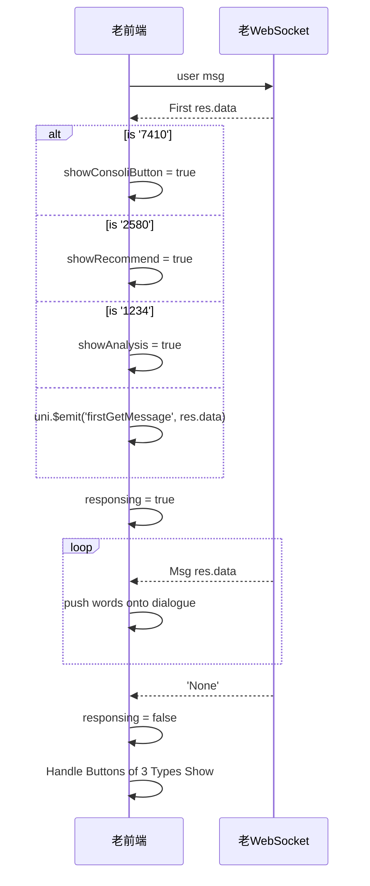
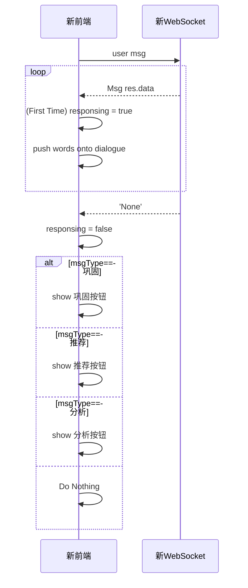
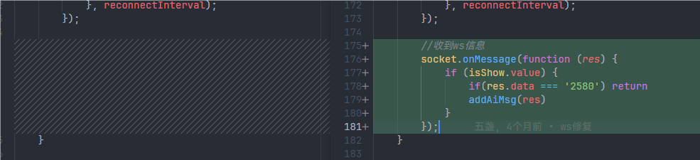
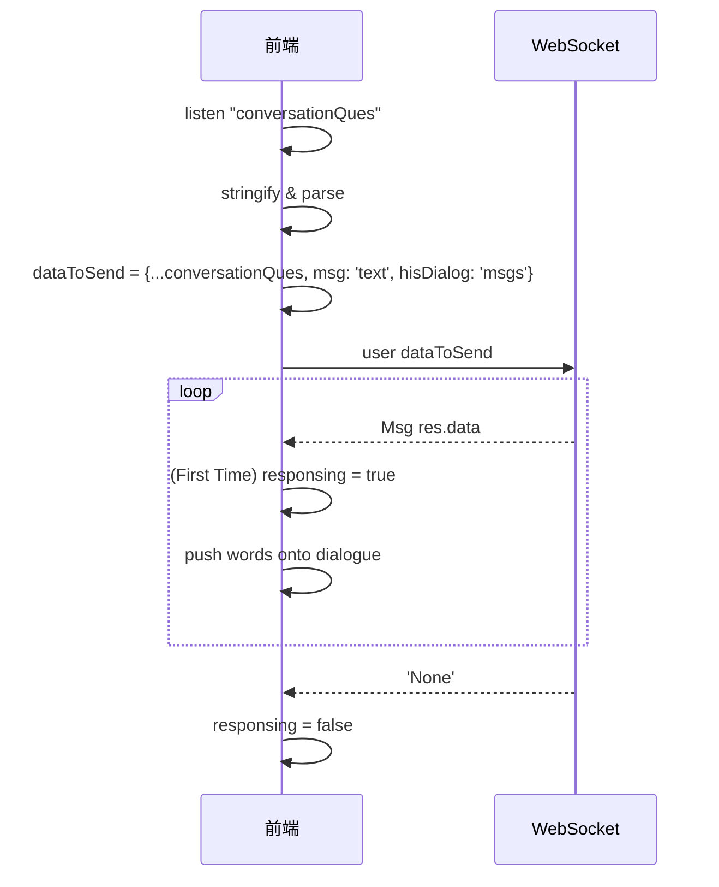
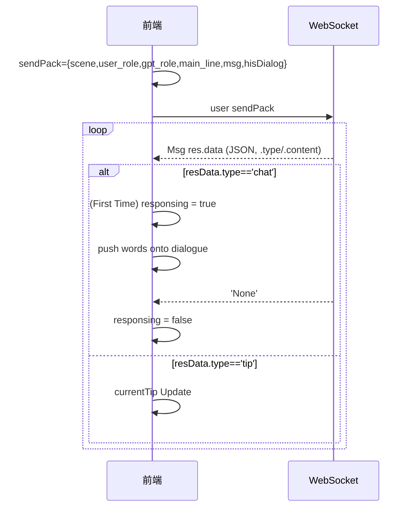

# zyxt ws交互

## AiConversationCom.vue

原版：

```mermaid
sequenceDiagram
	participant a as 老前端
	participant b as 老WebSocket
	a->>b:user msg
	b-->>a:First res.data
	alt is '7410'
    	a->>a:showConsoliButton = true
    else is '2580'
    	a->>a:showRecommend = true
    else is '1234'
    	a->>a:showAnalysis = true
    else
    	a->>a:uni.$emit('firstGetMessage', res.data)
	end
	a->>a:responsing = true
	loop
		b-->>a: Msg res.data
		a->>a:push words onto dialogue
	end
	b-->>a:'None'
	a->>a:responsing = false
	a->>a:Handle Buttons of 3 Types Show

```

新版Todo：

```mermaid
sequenceDiagram
	participant a as 新前端
	participant b as 新WebSocket
	a->>b:user msg
	loop
		b-->>a: Msg res.data
		a->>a:(First Time) responsing = true
		a->>a:push words onto dialogue
	end
	b-->>a:'None'
	a->>a:responsing = false
	alt msgType==巩固
		a->>a:show 巩固按钮
	else msgType==推荐
		a->>a:show 推荐按钮
	else msgType==分析
		a->>a:show 分析按钮
	else
		a->>a:Do Nothing
	end

```

And：

>  what is 3690？

## QuesAiConversationCom.vue

```mermaid
sequenceDiagram
	participant a as 前端
	participant b as WebSocket
	a->>a:listen "conversationQues"
	a->>a:stringify & parse
	a->>a:dataToSend = {...conversationQues, msg: 'text', hisDialog: 'msgs'}
	a->>b:user dataToSend
	loop
		b-->>a: Msg res.data
		a->>a:(First Time) responsing = true
		a->>a:push words onto dialogue
	end
	b-->>a:'None'
	a->>a:responsing = false
	
```

## CustomNewQues.vue

围绕 `CustomNewQues` 对象

## RealTimeTalkingPage.vue

```mermaid
sequenceDiagram
	participant a as 前端
	participant b as WebSocket
	a->>a:sendPack={scene,user_role,gpt_role,main_line,msg,hisDialog}
	a->>b:user sendPack
	loop
		b-->>a: Msg res.data (JSON, .type/.content)
		alt resData.type=='chat'
			a->>a:(First Time) responsing = true
			a->>a:push words onto dialogue
			b-->>a:'None'
			a->>a:responsing = false
		else resData.type=='tip'
			a->>a:currentTip Update
		end
		
	end
	
	
```

